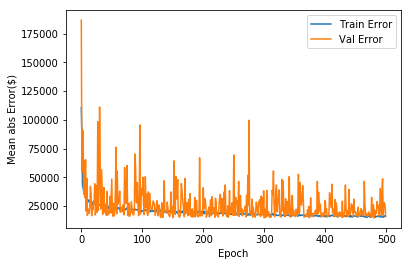
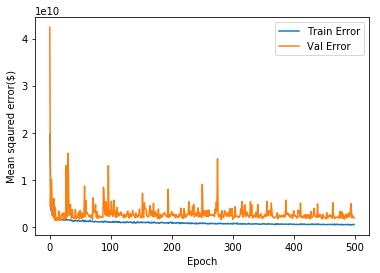
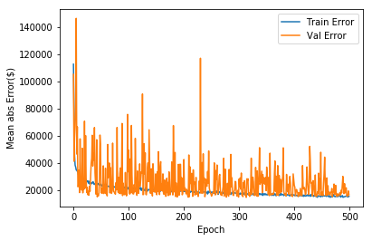
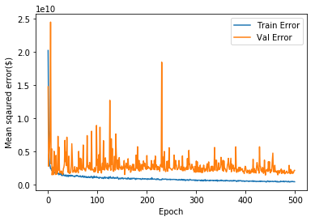
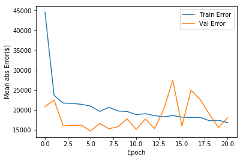
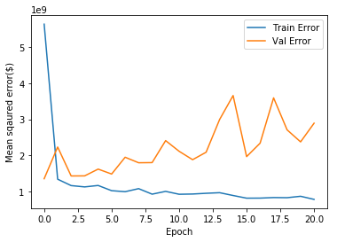

```python
import pandas as pd

! git clone https://github.com/hasanulkarim/kaggle---house-price-prediction.git
```

    fatal: destination path 'kaggle---house-price-prediction' already exists and is not an empty directory.
    


```python
!ls
```

    data_description.txt		 sample_submission.csv	train.csv
    kaggle---house-price-prediction  test.csv
    


```python
cd kaggle---house-price-prediction/
```

    /content/kaggle---house-price-prediction/kaggle---house-price-prediction
    


```python
#!ls
```


```python
train = pd.read_csv('train.csv')
test = pd.read_csv('test.csv')
train.tail()
```


<div>
<style scoped>
    .dataframe tbody tr th:only-of-type {
        vertical-align: middle;
    }

    .dataframe tbody tr th {
        vertical-align: top;
    }

    .dataframe thead th {
        text-align: right;
    }
</style>
<table border="1" class="dataframe">
  <thead>
    <tr style="text-align: right;">
      <th></th>
      <th>Id</th>
      <th>MSSubClass</th>
      <th>MSZoning</th>
      <th>LotFrontage</th>
      <th>LotArea</th>
      <th>Street</th>
      <th>Alley</th>
      <th>LotShape</th>
      <th>LandContour</th>
      <th>Utilities</th>
      <th>...</th>
      <th>PoolArea</th>
      <th>PoolQC</th>
      <th>Fence</th>
      <th>MiscFeature</th>
      <th>MiscVal</th>
      <th>MoSold</th>
      <th>YrSold</th>
      <th>SaleType</th>
      <th>SaleCondition</th>
      <th>SalePrice</th>
    </tr>
  </thead>
  <tbody>
    <tr>
      <th>1455</th>
      <td>1456</td>
      <td>60</td>
      <td>RL</td>
      <td>62.0</td>
      <td>7917</td>
      <td>Pave</td>
      <td>NaN</td>
      <td>Reg</td>
      <td>Lvl</td>
      <td>AllPub</td>
      <td>...</td>
      <td>0</td>
      <td>NaN</td>
      <td>NaN</td>
      <td>NaN</td>
      <td>0</td>
      <td>8</td>
      <td>2007</td>
      <td>WD</td>
      <td>Normal</td>
      <td>175000</td>
    </tr>
    <tr>
      <th>1456</th>
      <td>1457</td>
      <td>20</td>
      <td>RL</td>
      <td>85.0</td>
      <td>13175</td>
      <td>Pave</td>
      <td>NaN</td>
      <td>Reg</td>
      <td>Lvl</td>
      <td>AllPub</td>
      <td>...</td>
      <td>0</td>
      <td>NaN</td>
      <td>MnPrv</td>
      <td>NaN</td>
      <td>0</td>
      <td>2</td>
      <td>2010</td>
      <td>WD</td>
      <td>Normal</td>
      <td>210000</td>
    </tr>
    <tr>
      <th>1457</th>
      <td>1458</td>
      <td>70</td>
      <td>RL</td>
      <td>66.0</td>
      <td>9042</td>
      <td>Pave</td>
      <td>NaN</td>
      <td>Reg</td>
      <td>Lvl</td>
      <td>AllPub</td>
      <td>...</td>
      <td>0</td>
      <td>NaN</td>
      <td>GdPrv</td>
      <td>Shed</td>
      <td>2500</td>
      <td>5</td>
      <td>2010</td>
      <td>WD</td>
      <td>Normal</td>
      <td>266500</td>
    </tr>
    <tr>
      <th>1458</th>
      <td>1459</td>
      <td>20</td>
      <td>RL</td>
      <td>68.0</td>
      <td>9717</td>
      <td>Pave</td>
      <td>NaN</td>
      <td>Reg</td>
      <td>Lvl</td>
      <td>AllPub</td>
      <td>...</td>
      <td>0</td>
      <td>NaN</td>
      <td>NaN</td>
      <td>NaN</td>
      <td>0</td>
      <td>4</td>
      <td>2010</td>
      <td>WD</td>
      <td>Normal</td>
      <td>142125</td>
    </tr>
    <tr>
      <th>1459</th>
      <td>1460</td>
      <td>20</td>
      <td>RL</td>
      <td>75.0</td>
      <td>9937</td>
      <td>Pave</td>
      <td>NaN</td>
      <td>Reg</td>
      <td>Lvl</td>
      <td>AllPub</td>
      <td>...</td>
      <td>0</td>
      <td>NaN</td>
      <td>NaN</td>
      <td>NaN</td>
      <td>0</td>
      <td>6</td>
      <td>2008</td>
      <td>WD</td>
      <td>Normal</td>
      <td>147500</td>
    </tr>
  </tbody>
</table>
<p>5 rows × 81 columns</p>
</div>


**put train_X and test set together for ease of operation for the next few steps** 


```python
train_test = [train,test]

train_test = [dataset.drop(['PoolQC','MiscFeature', 'Alley', 'Fence', 'FireplaceQu'], axis =1) for dataset in train_test]

```


```python
#split out numerical and categorical columns into two for test and train_X table to apply one hot and imputer easily through pipeline
num_attribs = list(test._get_numeric_data()) 
num_attribs = num_attribs[1:]

len(num_attribs)
```


    36


```python
#categorical attributes

cat_attribs = list(train_test[1].select_dtypes(include='object')) #Doesnt really mater if you use train_test[0] instead
len(cat_attribs)

```


    38


```python
train_cat_cats = [train_test[0][cat_attribs][i].value_counts() for i in cat_attribs]

```


```python
test_cat_cats = [train_test[1][cat_attribs][i].value_counts() for i in cat_attribs]
```


```python
z = [] # empty list, we will append all categorical columns where number of category is 
        #not equal between test and train
for i in range(38):
  y = len(train_cat_cats[i]) == len(test_cat_cats[i])
  if y == False:
    print(i,y,train_cat_cats[i].name)
    z.append(train_cat_cats[i].name)
```

    4 False Utilities
    9 False Condition2
    11 False HouseStyle
    13 False RoofMatl
    14 False Exterior1st
    15 False Exterior2nd
    25 False Heating
    28 False Electrical
    33 False GarageQual
    


```python

```


```python
train_test = [dataset.drop(z, axis =1) for dataset in train_test]
```


```python
#sanity check

train.shape, test.shape, train_test[0].shape, train_test[1].shape
```


    ((1460, 81), (1459, 80), (1460, 67), (1459, 66))


```python
#repeat and reassign the shorte cat list after dropping the mismatched columns
cat_attribs = list(train_test[1].select_dtypes(include='object')) #Doesnt really mater if you use train_test[0] instead
len(cat_attribs)
```


    29


```python
train_test[0][cat_attribs].isna().sum().sort_values(ascending = False)
```


    GarageCond       81
    GarageFinish     81
    GarageType       81
    BsmtExposure     38
    BsmtFinType2     38
    BsmtQual         37
    BsmtCond         37
    BsmtFinType1     37
    MasVnrType        8
    BldgType          0
    Condition1        0
    Neighborhood      0
    LandSlope         0
    LotConfig         0
    LandContour       0
    LotShape          0
    Street            0
    RoofStyle         0
    SaleCondition     0
    ExterQual         0
    ExterCond         0
    Foundation        0
    SaleType          0
    HeatingQC         0
    CentralAir        0
    KitchenQual       0
    Functional        0
    PavedDrive        0
    MSZoning          0
    dtype: int64


```python
train_test[0][cat_attribs].head()
```


<div>
<style scoped>
    .dataframe tbody tr th:only-of-type {
        vertical-align: middle;
    }

    .dataframe tbody tr th {
        vertical-align: top;
    }

    .dataframe thead th {
        text-align: right;
    }
</style>
<table border="1" class="dataframe">
  <thead>
    <tr style="text-align: right;">
      <th></th>
      <th>MSZoning</th>
      <th>Street</th>
      <th>LotShape</th>
      <th>LandContour</th>
      <th>LotConfig</th>
      <th>LandSlope</th>
      <th>Neighborhood</th>
      <th>Condition1</th>
      <th>BldgType</th>
      <th>RoofStyle</th>
      <th>...</th>
      <th>HeatingQC</th>
      <th>CentralAir</th>
      <th>KitchenQual</th>
      <th>Functional</th>
      <th>GarageType</th>
      <th>GarageFinish</th>
      <th>GarageCond</th>
      <th>PavedDrive</th>
      <th>SaleType</th>
      <th>SaleCondition</th>
    </tr>
  </thead>
  <tbody>
    <tr>
      <th>0</th>
      <td>RL</td>
      <td>Pave</td>
      <td>Reg</td>
      <td>Lvl</td>
      <td>Inside</td>
      <td>Gtl</td>
      <td>CollgCr</td>
      <td>Norm</td>
      <td>1Fam</td>
      <td>Gable</td>
      <td>...</td>
      <td>Ex</td>
      <td>Y</td>
      <td>Gd</td>
      <td>Typ</td>
      <td>Attchd</td>
      <td>RFn</td>
      <td>TA</td>
      <td>Y</td>
      <td>WD</td>
      <td>Normal</td>
    </tr>
    <tr>
      <th>1</th>
      <td>RL</td>
      <td>Pave</td>
      <td>Reg</td>
      <td>Lvl</td>
      <td>FR2</td>
      <td>Gtl</td>
      <td>Veenker</td>
      <td>Feedr</td>
      <td>1Fam</td>
      <td>Gable</td>
      <td>...</td>
      <td>Ex</td>
      <td>Y</td>
      <td>TA</td>
      <td>Typ</td>
      <td>Attchd</td>
      <td>RFn</td>
      <td>TA</td>
      <td>Y</td>
      <td>WD</td>
      <td>Normal</td>
    </tr>
    <tr>
      <th>2</th>
      <td>RL</td>
      <td>Pave</td>
      <td>IR1</td>
      <td>Lvl</td>
      <td>Inside</td>
      <td>Gtl</td>
      <td>CollgCr</td>
      <td>Norm</td>
      <td>1Fam</td>
      <td>Gable</td>
      <td>...</td>
      <td>Ex</td>
      <td>Y</td>
      <td>Gd</td>
      <td>Typ</td>
      <td>Attchd</td>
      <td>RFn</td>
      <td>TA</td>
      <td>Y</td>
      <td>WD</td>
      <td>Normal</td>
    </tr>
    <tr>
      <th>3</th>
      <td>RL</td>
      <td>Pave</td>
      <td>IR1</td>
      <td>Lvl</td>
      <td>Corner</td>
      <td>Gtl</td>
      <td>Crawfor</td>
      <td>Norm</td>
      <td>1Fam</td>
      <td>Gable</td>
      <td>...</td>
      <td>Gd</td>
      <td>Y</td>
      <td>Gd</td>
      <td>Typ</td>
      <td>Detchd</td>
      <td>Unf</td>
      <td>TA</td>
      <td>Y</td>
      <td>WD</td>
      <td>Abnorml</td>
    </tr>
    <tr>
      <th>4</th>
      <td>RL</td>
      <td>Pave</td>
      <td>IR1</td>
      <td>Lvl</td>
      <td>FR2</td>
      <td>Gtl</td>
      <td>NoRidge</td>
      <td>Norm</td>
      <td>1Fam</td>
      <td>Gable</td>
      <td>...</td>
      <td>Ex</td>
      <td>Y</td>
      <td>Gd</td>
      <td>Typ</td>
      <td>Attchd</td>
      <td>RFn</td>
      <td>TA</td>
      <td>Y</td>
      <td>WD</td>
      <td>Normal</td>
    </tr>
  </tbody>
</table>
<p>5 rows × 29 columns</p>
</div>


```python
test_with_Id = train_test[1]
test_with_Id.shape
```


    (1459, 66)


```python
train_test[0].shape, train_test[1].shape
```


    ((1460, 67), (1459, 66))


```python
train_test = [dataset.drop(['Id'], axis = 1) for dataset in train_test]
```

#This is important - quickly define numerical and categorical pipeline for numerical data and categorical data operations


```python
#defining simpleimputer for numerical missing values and onehot encoder for categorical values

from sklearn.pipeline import Pipeline
from sklearn.preprocessing import StandardScaler
from sklearn.impute import SimpleImputer
from sklearn.preprocessing import OneHotEncoder

num_pipeline = Pipeline([
    ('imputer', SimpleImputer(strategy = 'median')),
    ('std_scaler', StandardScaler())
])

cat_pipeline = Pipeline([
    ('imputer', SimpleImputer(strategy = 'most_frequent')),
    ('cat_onehot', OneHotEncoder(sparse = False),)
])
```

#Use columnTransformer to execute full pipeline at once on the datasets, use list comprehension to perform it on both train and test set


```python
from sklearn.compose import ColumnTransformer

full_pipeline = ColumnTransformer([
    ('num', num_pipeline, num_attribs),
    ('cat', cat_pipeline, cat_attribs)
],remainder='passthrough')

train_test_prepared = [full_pipeline.fit_transform(dataset) for dataset in train_test]
```


```python
train_test_prepared[0].shape, train_test_prepared[1].shape
```


    ((1460, 198), (1459, 197))


```python
len(full_pipeline.transformers_[0][2]), len(full_pipeline.transformers_[1][2])
```


    (36, 29)


```python
len(full_pipeline.transformers_[1][1].named_steps['cat_onehot'].get_feature_names())
```


    161


```python
#perform stratified K fold split

from sklearn.model_selection import StratifiedKFold

X = train_test_prepared[0][:,:197]
#X = X.toarray()
y = train_test_prepared[0][:,197]

skf = StratifiedKFold(n_splits=2, random_state=2, shuffle=False)

for train_index, val_index in skf.split(X, y):
  #print("TRAIN:", train_index, "val:", val_index)
  X_train, X_val = X[train_index], X[val_index]
  y_train, y_val = y[train_index], y[val_index]

```

    /usr/local/lib/python3.6/dist-packages/sklearn/model_selection/_split.py:652: Warning: The least populated class in y has only 1 members, which is too few. The minimum number of members in any class cannot be less than n_splits=2.
      % (min_groups, self.n_splits)), Warning)
    

#Building a dense neural network


```python
#Let's build a very simple denese sequential network using keras
import tensorflow as tf
from keras.models import Sequential
#from keras.layers import Dense
from tensorflow import keras
from tensorflow.keras import layers

# model = Sequential([
#     Dense(10, activation ='relu', input_shape =(10,)),
#     Dense(10, activation = 'relu'),
#     Dense(10, activation = 'relu'),
#     Dense(10, activation = 'relu'),
#     Dense(1)
# ])

def build_model():
  model = keras.Sequential([
      layers.Dense(1000, activation = tf.nn.relu, input_shape =(197,)),
      layers.Dense(1000, activation = tf.nn.relu),
      layers.Dense(1000, activation = tf.nn.relu),
      layers.Dense(500, activation = tf.nn.relu),
      layers.Dense(1)
  ])
  
  optimizer = tf.keras.optimizers.RMSprop(0.001)
  
  model.compile(loss = 'mse',
               optimizer = optimizer,
               metrics =['mae', 'mse'])
  return model
```


```python
def build_model_with_dropout():
  model_dropout = keras.Sequential([
      layers.Dense(1000, activation = tf.nn.relu, input_shape =(197,)),
      layers.Dropout(0.3),
      layers.Dense(1000, activation = tf.nn.relu),
      layers.Dropout(0.3),
      layers.Dense(1000, activation = tf.nn.relu),
      layers.Dropout(0.3),
      layers.Dense(500, activation = tf.nn.relu),
      layers.Dense(1)
  ])
  
  optimizer = tf.keras.optimizers.RMSprop(0.001)
  
  model_dropout.compile(loss = 'mse',
               optimizer = optimizer,
               metrics =['mae', 'mse'])
  return model_dropout
```


```python
#model with regularization
from keras import regularizers

def build_model_reg_drop():
  model_reg_drop = keras.Sequential([
      layers.Dense(1000, activation = tf.nn.relu, 
                   kernel_regularizer = regularizers.l2(0.01), input_shape =(197,)),
      layers.Dropout(0.3),
      layers.Dense(1000, activation = tf.nn.relu,
                  kernel_regularizer = regularizers.l2(0.01)),
      layers.Dropout(0.3),
      layers.Dense(1000, activation = tf.nn.relu,
                  kernel_regularizer = regularizers.l2(0.01)),
      layers.Dropout(0.3),
      layers.Dense(1000, activation = tf.nn.relu,
                  kernel_regularizer = regularizers.l2(0.01)),
      layers.Dense(1)
  ])
  
  optimizer = tf.keras.optimizers.RMSprop(0.001)
  
  model_reg_drop.compile(loss = 'mse',
               optimizer = optimizer,
               metrics =['mae', 'mse'])
  return model_reg_drop
```


```python
model = build_model()
```


```python
#to run with the dropout
model_dropout = build_model_with_dropout()
```


```python
#to run with l2 reg and dropout
model_reg_drop = build_model_reg_drop()

```


```python
model.summary()
```

    _________________________________________________________________
    Layer (type)                 Output Shape              Param #   
    =================================================================
    dense_55 (Dense)             (None, 1000)              198000    
    _________________________________________________________________
    dense_56 (Dense)             (None, 1000)              1001000   
    _________________________________________________________________
    dense_57 (Dense)             (None, 1000)              1001000   
    _________________________________________________________________
    dense_58 (Dense)             (None, 500)               500500    
    _________________________________________________________________
    dense_59 (Dense)             (None, 1)                 501       
    =================================================================
    Total params: 2,701,001
    Trainable params: 2,701,001
    Non-trainable params: 0
    _________________________________________________________________
    


```python
model_dropout.summary()
```

    _________________________________________________________________
    Layer (type)                 Output Shape              Param #   
    =================================================================
    dense_60 (Dense)             (None, 1000)              198000    
    _________________________________________________________________
    dropout_24 (Dropout)         (None, 1000)              0         
    _________________________________________________________________
    dense_61 (Dense)             (None, 1000)              1001000   
    _________________________________________________________________
    dropout_25 (Dropout)         (None, 1000)              0         
    _________________________________________________________________
    dense_62 (Dense)             (None, 1000)              1001000   
    _________________________________________________________________
    dropout_26 (Dropout)         (None, 1000)              0         
    _________________________________________________________________
    dense_63 (Dense)             (None, 500)               500500    
    _________________________________________________________________
    dense_64 (Dense)             (None, 1)                 501       
    =================================================================
    Total params: 2,701,001
    Trainable params: 2,701,001
    Non-trainable params: 0
    _________________________________________________________________
    


```python
model_reg_drop.summary()
```

    _________________________________________________________________
    Layer (type)                 Output Shape              Param #   
    =================================================================
    dense_70 (Dense)             (None, 1000)              198000    
    _________________________________________________________________
    dropout_30 (Dropout)         (None, 1000)              0         
    _________________________________________________________________
    dense_71 (Dense)             (None, 1000)              1001000   
    _________________________________________________________________
    dropout_31 (Dropout)         (None, 1000)              0         
    _________________________________________________________________
    dense_72 (Dense)             (None, 1000)              1001000   
    _________________________________________________________________
    dropout_32 (Dropout)         (None, 1000)              0         
    _________________________________________________________________
    dense_73 (Dense)             (None, 1000)              1001000   
    _________________________________________________________________
    dense_74 (Dense)             (None, 1)                 1001      
    =================================================================
    Total params: 3,202,001
    Trainable params: 3,202,001
    Non-trainable params: 0
    _________________________________________________________________
    


```python
from timeit import default_timer as timer

class PrintDot(keras.callbacks.Callback):
  def on_epoch_end(self, epoch, logs):
    if epoch % 100 ==0: print('')
    print('.', end='')

start = timer()

history_reg_drop = model_reg_drop.fit(X_train,y_train,
                batch_size=12, epochs =100, verbose =0,
                validation_data=(X_val,y_val),
                callbacks = [PrintDot()])

end = timer()

model_reg_drop_time = end - start
print('model_time = ',  model_reg_drop_time)
```

    
    ....................................................................................................
    ....................................................................................................
    ....................................................................................................
    ....................................................................................................
    ....................................................................................................model_time =  171.54485083799955
    


```python
import matplotlib.pyplot as plt

def plot_history(history):
  hist = pd.DataFrame(history.history)
  hist['epoch'] = history.epoch
  
  plt.figure()
  plt.xlabel('Epoch')
  plt.ylabel('Mean abs Error($)')
  
  plt.plot(hist['epoch'], hist['mean_absolute_error'],
          label ='Train Error')
  
  plt.plot(hist['epoch'], hist['val_mean_absolute_error'],
          label = 'Val Error')
  
  plt.legend()
  #plt.ylim([0,5])
  
  
  plt.figure()
  plt.xlabel('Epoch')
  plt.ylabel('Mean sqaured error($)')
  
  plt.plot(hist['epoch'], hist['mean_squared_error'],
          label = 'Train Error')
  plt.plot(hist['epoch'], hist['val_mean_squared_error'],
          label = 'Val Error')
  
  plt.legend()
  
plot_history(history_dropout)  
```








```python
import matplotlib.pyplot as plt

def plot_history(history):
  """plots the MAE and MSE per epoch, uncomment the lines to play with x and y limits if needed"""
  hist = pd.DataFrame(history.history)
  hist['epoch'] = history.epoch
  
  plt.figure()
  #plt.title('With droput(0.3)')
  plt.xlabel('Epoch')
  plt.ylabel('Mean abs Error($)')
  
  plt.plot(hist['epoch'], hist['mean_absolute_error'],
          label ='Train Error')
  
  plt.plot(hist['epoch'], hist['val_mean_absolute_error'],
          label = 'Val Error')
  
  plt.legend()
  #plt.xlim([0,70])
  #plt.ylim([0,5])
  
  
  plt.figure()
  #plt.title('with dropout(0.3)')
  plt.xlabel('Epoch')
  plt.ylabel('Mean sqaured error($)')
  
  plt.plot(hist['epoch'], hist['mean_squared_error'],
          label = 'Train Error')
  plt.plot(hist['epoch'], hist['val_mean_squared_error'],
          label = 'Val Error')
  
  plt.legend()
  #plt.xlim([0,70])
  #plt.ylim([0,2])
  
plot_history(history_dropout)  
```


```python
plot_history(history_reg_drop)  
```








```python
#lets do early stopping now and see how it goes
early_stop = keras.callbacks.EarlyStopping(monitor = 'val_loss',  patience = 20)


history_reg_drop_early = model_reg_drop.fit(X_train,y_train,
                batch_size=12, epochs =500, verbose =0,
                validation_data=(X_val,y_val), callbacks = [early_stop, PrintDot()])

plot_history(history_reg_drop_early)
```

    
    .....................








```python
#time to predict
X_test = train_test_prepared[1]

test_predictions = model_reg_drop.predict(X_test)

test_predictions = test_predictions.reshape(len(test_predictions),)
```


```python
preds = pd.DataFrame({
    "Id":test_with_Id['Id'],
    'SalePrice':test_predictions})
```


```python
preds.head()
```


<div>
<style scoped>
    .dataframe tbody tr th:only-of-type {
        vertical-align: middle;
    }

    .dataframe tbody tr th {
        vertical-align: top;
    }

    .dataframe thead th {
        text-align: right;
    }
</style>
<table border="1" class="dataframe">
  <thead>
    <tr style="text-align: right;">
      <th></th>
      <th>Id</th>
      <th>SalePrice</th>
    </tr>
  </thead>
  <tbody>
    <tr>
      <th>0</th>
      <td>1461</td>
      <td>125464.703125</td>
    </tr>
    <tr>
      <th>1</th>
      <td>1462</td>
      <td>165724.312500</td>
    </tr>
    <tr>
      <th>2</th>
      <td>1463</td>
      <td>195608.671875</td>
    </tr>
    <tr>
      <th>3</th>
      <td>1464</td>
      <td>209495.765625</td>
    </tr>
    <tr>
      <th>4</th>
      <td>1465</td>
      <td>208414.265625</td>
    </tr>
  </tbody>
</table>
</div>


```python
preds.to_csv('submission_house_price_DNN.csv', index = False)
```


```python
final = pd.read_csv('submission_house_price_DNN.csv')
```


```python
!ls #check if the file is saved and ready to submit
```

    data_description.txt   submission_house_price_DNN.csv  train.csv
    sample_submission.csv  test.csv
    
